# Methods to Minimize Grocery Expenses

## Abstract ##
This research project intends to derive and evaluate methods to minimize grocery costs. The construct leverages an R-shiny application for price analysis between three grocery store tiers: national, regional, and local. Results show store tiers influence grocery costs given specific diets. Additionally, the selection of product brands (private label vs. national) significantly affects grocery costs.

## Overview ##

Following presents three known factors to minimize grocery costs:

1. Store Tiers
2. Product Brands
3. Diet

 The intention is to derive methods to represent factors in assessing their impact on expenditure. Specifically, by utilizing an R-Shiny application to test the significance of the derived methods in minimizing grocery prices. The following presents design and implementation of methods in association with factors.

1. Store Tiers – local, regional, and national

    We can quantify price significance by comparing grocery prices from three store tiers – local, regional, and national. The distinguishment of store tiers is dependent on the geographic area covered and the number of stores
    | Store      | Tier | Availability by Region     |
    | :---        |    :----:   |          ---: |
    | Streets Market      | Local       | Baltimore/Washington   |
    | Safeway   | Regional        | West Coast/East Coast      |
    | Walmart   | National        | Across the US

    
    In terms of process, an identical basket of randomly sampled products is fetched from each store. Then, applying the ANOVA test will answer the proposed question - of whether store tiers (independent variable) influence grocery prices (dependent variable).
2. Product Brands – Private vs National

    As noted by McKinsey & Company, consumers seek private label products at a low-cost price compared to national brand products. Therefore, we can formulate a method to assess this factor by randomly selecting an equal number of identical private and national brand products from Walmart and Safeway and calculate the mean difference in price. Then, to assess significance, we can apply a lower tailed test (one side t-test) to confirm whether you spend less by purchasing private brand products than national brand products.

3. Diet – Calories and Consumption of Food Groups

    Expenditure on groceries is significantly dependent on the quantity and types of foods you eat. Thus, it’s essential to consider various types of diets and desired calories to minimize grocery costs. We can incorporate this factor by enabling the input of desired calories and the percentage intake of said calories from each food group - vegetables, fruit, protein, dairy, and grain. Upon user input, a randomly sampled basket of groceries is fetched in accordance with desired calories and food group weighting. Note that the price will reflect the product by serving size.

## Results ##

This section outlines results of previously described methods in evaluating the effectiveness of minimizing grocery costs. Recall that the intention is to utilize an R-shiny app for price analysis among three grocery stores – Walmart, Safeway, and Streets Market. The application intakes user input to define desired calories and food group weighting, as depicted in the figure below

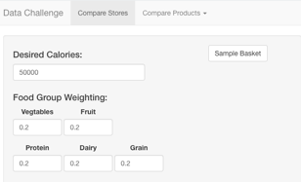

__1. Store Tiers – local, regional, and national__

Initially testing an “Even-split” diet constrained to 50,000 calories outputs below sampled basket consisting of 36 items. The table depicts randomly sampled items, number of servings, calories, and price of servings for each store. 

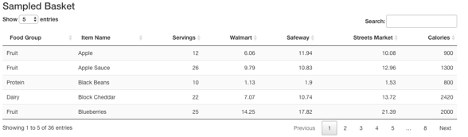

Additionally, the application output a boxplot depicting the mean price per serving of each store as shown.

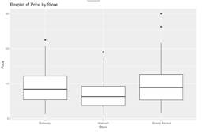

To quantify significance, the application output ANOVA test result: 

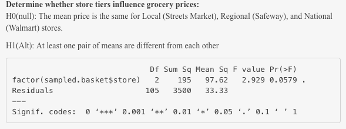

The p-value is 0.0579 – merely above our defined threshold of 0.05 significance. However, it’s necessary to understand that an ANOVA test assesses significance among multiple groups  ( >2). In viewing the boxplot, you can see the mean price of Streets Market and Safeway are closely correlated while Walmart is lower. Said relationship is worth investigating further before concluding on price significance. We can do this by leveraging lower tailed T-tests:

_Walmart < Safeway_

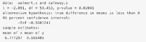

_Walmart < Streets Market_

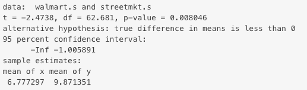

_Safeway < Streets  Market_

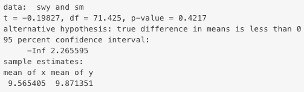

Implementing lower-tailed tests allows us to confirm the hierarchical relationship in the price of store tiers - national < regional < local. In viewing the results, you can see the p-values yield significance in testing whether the mean price of Walmart is less than Safeway (p-vale 0.02041) and the mean price of Walmart is less than Streets Market (p-value 0.008046). Furthermore, this is not the case when testing whether Safeway is less than Streets Market (p-value 0.4217). Therefore, data provide convincing evidence that population prices of product servings in Walmart are lower than Safeway and Streets Market if adhering to an “Even-split” diet. 

__2. Product Brands – Private vs National__

The below table depicts a price comparison of private label products against national products:

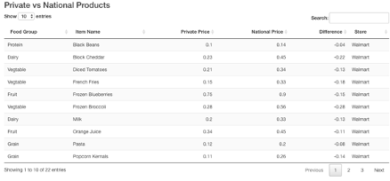

As mentioned, we apply a lower tailed test to determine whether it is cheaper to purchase private brand products over national brand products:

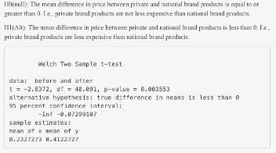

You can see the p-value of said test result as 0.003553 – providing convincing evidence to reject the null hypothesis. Therefore, concluding that the population prices of private products are lower than national products.   

__3. Diet – Calories and Consumption of Food Groups__

To compare and quantify diet types and their effect on price, we can leverage the “Compare Diets” section within the R-shiny application. The below figure depicts the required input.

 As shown, all diets are selected for comparison. “Calories Range” shows 10,000 to 50,000 calories with “Step” of 5000 – plot the total price of randomly sampled baskets per increment of calories in range. The below figure depicts a linear regression plot showing the rate of the price increase by calories per diet. Note “user” diet is of even-split in food group weighting.

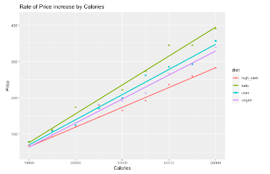

 Viewing the figure, you can see adhering to a “keto” diet yields the highest rate of price change, while “high-carb” is the lowest. In addition, we can numerically depict the rate of change per diet by viewing linear regression coefficients.  

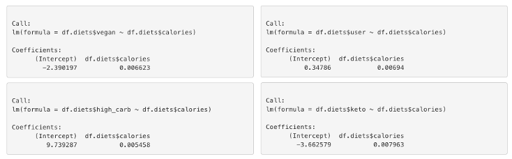

 Results show an estimated coefficient of 0.007963 for “keto” and 0.005458 for “high-carb” – i.e., adhering keto diet costs $0.007963 per calorie while a high-carb diet costs $0.005458 per calorie. Said findings imply a 45% price premium for keto consumers relative to high-carb consumers. Thus, data provide convincing evidence that consumers should intake less protein and more carbs to minimize costs.  